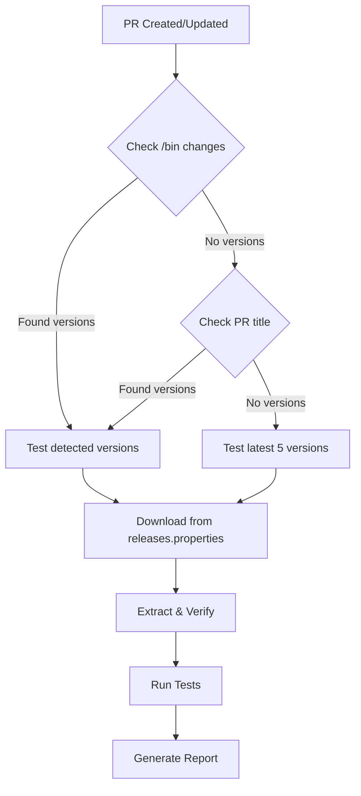
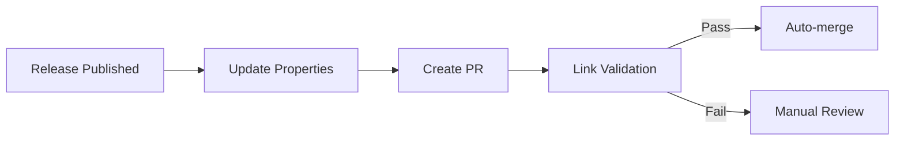
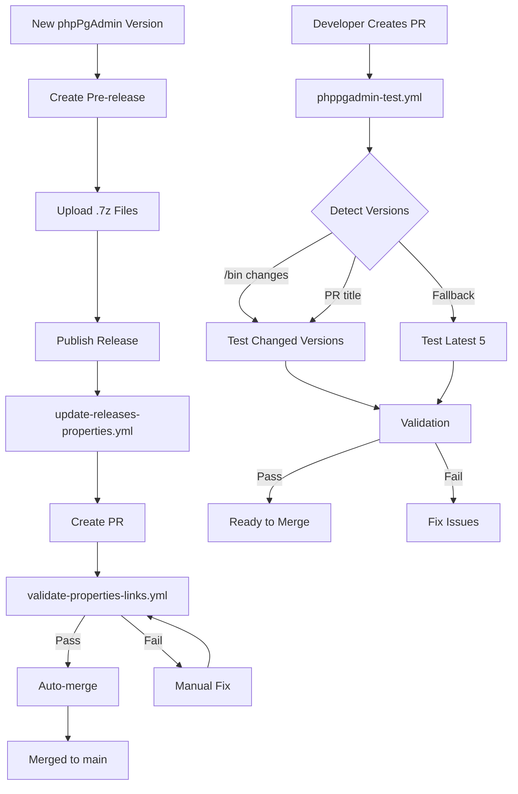

# phpPgAdmin CI/CD Workflows

This directory contains GitHub Actions workflows for automated testing, validation, and release management of the phpPgAdmin module.

## 📋 Table of Contents

- [Workflows Overview](#workflows-overview)
- [phppgadmin-test.yml](#phppgadmin-testyml)
- [update-releases-properties.yml](#update-releases-propertiesyml)
- [validate-properties-links.yml](#validate-properties-linksyml)
- [Setup Requirements](#setup-requirements)
- [Usage Examples](#usage-examples)

---

## Workflows Overview

### 1. **phppgadmin-test.yml** - Pull Request Testing
Automatically tests phpPgAdmin versions included in pull requests with smart version detection.

### 2. **update-releases-properties.yml** - Release Automation
Automatically updates `releases.properties` when new releases are published.

### 3. **validate-properties-links.yml** - Link Validation
Validates all download URLs in properties files to ensure they're accessible.

---

## phppgadmin-test.yml

### Purpose
Tests phpPgAdmin versions from pull requests with intelligent version detection to reduce CI runtime by testing only relevant versions.

### Triggers
- **Pull Request Events**: `opened`, `synchronize`, `reopened`, `edited` on `main` branch
- **Manual Dispatch**: Test specific versions or latest N versions

### Smart Version Detection

The workflow uses a three-tier detection strategy:

#### 1. Primary Method: Changed Files in `/bin` Directory
- Automatically detects which phpPgAdmin versions are included in the PR
- Extracts version numbers from changed files in `/bin` directory
- Example: `bin/phppgadmin7.14.4/` → version `7.14.4`
- **Most efficient method** - only tests versions actually changed

#### 2. Fallback Method: PR Title Parsing
- If no versions found in `/bin`, extracts version numbers from PR title
- Supports multiple versions in title
- Example: "Add phpPgAdmin 7.14.4 and 7.14.7" → tests both versions

#### 3. Final Fallback: Latest N Versions
- If no versions detected by either method, tests the latest 5 versions
- Reads from `releases.properties` file on `main` branch
- Configurable via `test_latest` input (default: 5)

### How It Works



### Test Steps

For each detected version:

1. **Download**: Fetches the `.7z` archive from the URL in `releases.properties`
2. **Extract**: Extracts the archive using 7-Zip
3. **Verify Structure**: Checks for essential files:
   - `index.php`
   - `conf/config.inc.php-dist`
4. **Test Configuration**: Validates configuration template structure
5. **Generate Report**: Creates a test summary

### Manual Trigger

You can manually trigger tests via GitHub Actions UI:

**Test specific versions:**
```yaml
versions: "7.14.4,7.14.7"
```

**Test latest N versions:**
```yaml
test_latest: "3"
```

### Important Notes

- **fetch-depth: 0**: Required to access full git history for comparing with `main` branch
- **GH_PAT Token**: Required to download assets from pre-releases (private releases)
- **Windows Runner**: Tests run on Windows to match production environment
- **Parallel Testing**: Multiple versions tested in parallel using matrix strategy

### Example Output

```
=== Version Detection Strategy ===

🔍 Method 1: Checking for changed files in /bin directory...
Changed files in /bin:
bin/phppgadmin7.14.7/index.php
bin/phppgadmin7.14.7/conf/config.inc.php-dist

  ✓ Found version: 7.14.7

✅ Detected 1 version(s) from /bin directory changes

=== Final Version List ===
7.14.7

=== Summary ===
Total versions to test: 1
```

---

## update-releases-properties.yml

### Purpose
Automatically updates the `releases.properties` file when new releases are published, maintaining a centralized registry of all available phpPgAdmin versions.

### Triggers
- **Release Events**: `prereleased`, `released`, `edited`
- **Manual Dispatch**: Process a specific release tag

### Workflow Steps

1. **Extract Module Name**: Derives module name from repository name
2. **Fetch Release Data**: Gets release information via GitHub API
3. **Extract Assets**: Finds all `.7z` files in the release
4. **Parse Versions**: Extracts version numbers from filenames
5. **Update Properties**: Adds/updates entries in `releases.properties`
6. **Sort Entries**: Maintains semver ordering (newest first)
7. **Create PR**: Opens a pull request with the changes
8. **Auto-merge**: Enables auto-merge after validation passes

### Version Extraction

Supports various filename patterns:
- `bearsampp-phppgadmin-7.14.4-2023.4.25.7z` → `7.14.4`
- `phppgadmin7.13.0-2022.08.28.7z` → `7.13.0`

### Auto-merge Flow



---

## validate-properties-links.yml

### Purpose
Validates all download URLs in modified `.properties` files to ensure they're accessible before merging.

### Triggers
- **Pull Request Events**: When `.properties` files are modified

### Validation Process

1. **Detect Changed Files**: Identifies modified `.properties` files
2. **Extract URLs**: Parses all URLs from the files
3. **Validate Links**: Tests each URL with HTTP HEAD/GET requests
4. **Report Results**: Comments on PR with validation status

### Validation Methods

- **HEAD Request**: Fast check (preferred)
- **GET Request**: Fallback if HEAD fails
- **Timeout**: 10 seconds per URL
- **Rate Limiting**: 0.5s delay between requests

### Example Output

```
✅ Line 1: 7.14.7
   URL: https://github.com/.../bearsampp-phppgadmin-7.14.7-2024.4.14.7z
   Status: 200 OK

❌ Line 2: 7.14.4
   URL: https://github.com/.../invalid-file.7z
   Status: 404 Not Found
```

---

## Setup Requirements

### Required Secrets

#### `GH_PAT` (GitHub Personal Access Token)
**Required for:**
- Downloading assets from pre-releases
- Creating pull requests with auto-merge
- Accessing private release assets

**Permissions needed:**
- `repo` (Full control of private repositories)
- `workflow` (Update GitHub Action workflows)

**Setup:**
1. Go to GitHub Settings → Developer settings → Personal access tokens → Tokens (classic)
2. Generate new token with required permissions
3. Add to repository secrets as `GH_PAT`

### Repository Settings

1. **Enable Actions**: Settings → Actions → General → Allow all actions
2. **Workflow Permissions**: Settings → Actions → General → Read and write permissions
3. **Auto-merge**: Settings → General → Allow auto-merge

---

## Usage Examples

### Example 1: Creating a New Release

1. Create a pre-release with tag `2025.01.15`
2. Upload `.7z` files (e.g., `bearsampp-phppgadmin-7.14.7-2025.01.15.7z`)
3. Publish the release
4. **Automatic actions:**
   - `update-releases-properties.yml` triggers
   - Creates PR with updated `releases.properties`
   - `validate-properties-links.yml` validates URLs
   - PR auto-merges if validation passes

### Example 2: Testing a PR with New Versions

1. Create branch from `main` (e.g., `January`)
2. Add new version directories in `/bin`:
   ```
   bin/phppgadmin7.14.7/
   bin/phppgadmin7.14.8/
   ```
3. Update `releases.properties` with new entries
4. Create PR to `main`
5. **Automatic actions:**
   - `phppgadmin-test.yml` detects versions from `/bin` changes
   - Tests only `7.14.7` and `7.14.8` (not all versions)
   - Validates structure and configuration
   - Reports results in PR

### Example 3: Manual Testing

1. Go to Actions → phpPgAdmin Test → Run workflow
2. Choose options:
   - **Test specific versions**: `7.14.4,7.14.7`
   - **Test latest N**: `3`
3. Click "Run workflow"
4. View results in Actions tab

### Example 4: PR Title Detection

If you can't modify `/bin` files, use PR title:

**PR Title:** "Update phpPgAdmin 7.14.7 configuration"

The workflow will:
- Detect version `7.14.7` from title
- Test only that version
- Skip testing all other versions

---

## Workflow Integration

### Complete Release Cycle



---

## Troubleshooting

### Issue: "No versions detected by any method"

**Solutions:**
1. Add version directories to `/bin` (e.g., `bin/phppgadmin7.14.7/`)
2. Include version number in PR title (e.g., "Add 7.14.7")
3. Ensure `releases.properties` exists and has valid entries

### Issue: "Version X.X.X not found in releases.properties"

**Solutions:**
1. Ensure the version exists in `releases.properties` on the PR branch
2. Check that `releases.properties` was updated via the release workflow
3. Manually add the entry if needed

### Issue: "Download failed - 404 Not Found"

**Solutions:**
1. Verify the release exists and is published
2. Check that `GH_PAT` secret is configured
3. Ensure the asset URL in `releases.properties` is correct
4. For pre-releases, verify `GH_PAT` has access to private releases

### Issue: "Link validation failed"

**Solutions:**
1. Check workflow logs for specific failed URLs
2. Verify release assets are uploaded correctly
3. Ensure URLs in `releases.properties` are accessible
4. Re-upload missing assets if needed

---

## Best Practices

### For Release Management

1. **Use Pre-releases**: Create pre-releases first, then promote to full release
2. **Consistent Naming**: Follow naming pattern: `bearsampp-phppgadmin-{version}-{date}.7z`
3. **Version Format**: Use semantic versioning (e.g., `7.14.7`)
4. **Date Tags**: Use date format for release tags (e.g., `2025.01.15`)

### For Pull Requests

1. **Descriptive Titles**: Include version numbers in PR titles
2. **Organized Structure**: Add new versions to `/bin/phppgadmin{version}/`
3. **Update Properties**: Ensure `releases.properties` is updated
4. **Wait for Tests**: Let automated tests complete before merging

### For Testing

1. **Test Locally**: Verify structure before pushing
2. **Check Logs**: Review test output for issues
3. **Manual Testing**: Use workflow dispatch for specific version testing
4. **Incremental Changes**: Test one or two versions at a time

---

## Contributing

When adding new workflows or modifying existing ones:

1. Test changes in a fork first
2. Document new features in this README
3. Update examples if behavior changes
4. Ensure backward compatibility
5. Add comments to complex logic

---

## Support

For issues or questions:
- Check [Troubleshooting](#troubleshooting) section
- Review workflow logs in Actions tab
- Open an issue in the repository
- Contact the maintainers

---

**Last Updated:** 2025-01-15
**Workflow Version:** 1.0.0
